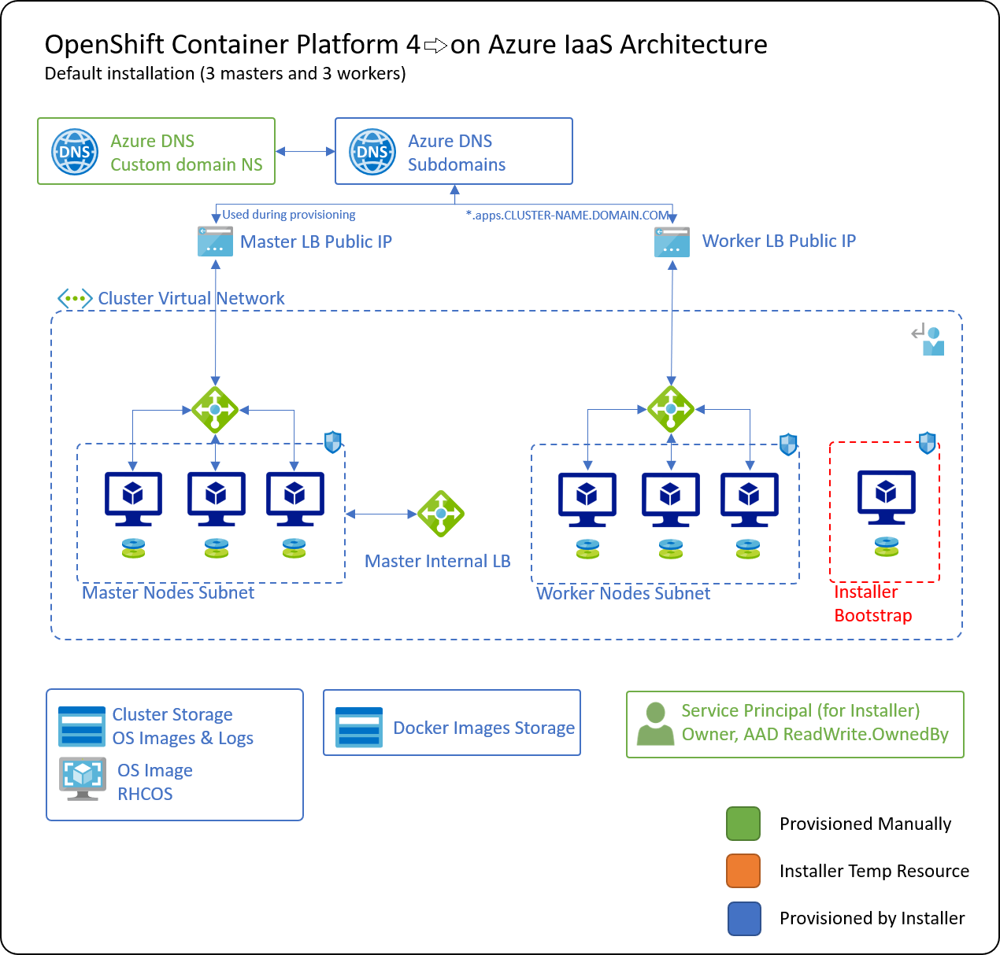

# OpenShift 4.x on Azure IaaS

Provisioning Red Hat OpenShift Container Platform 4.x (starting from 4.2) on Azure IaaS using the Red Hat's official Installer (Installer Provisioned Infrastructure or IPI).

Also soon you will be able to use Red Hat's (User Provided Infrastructure or UPI) to assume more control over the created infrastructure.

If you used the IPI method along with a public DNS (External cluster), you should arrive at an architecture similar to this:

## Azure CLI

Azure CLI is my preferred way to provision resources on Azure as it provide readable and repeatable steps to create multiple environments.

I will use Azure Cloud Shell to do that. Visit [Azure Cloud Shell](https://docs.microsoft.com/en-us/azure/cloud-shell/overview) documentation for further details, or visit [shell.azure.com](https://shell.azure.com) if you know your way around.

You can also use your favorite terminal as well (I use VS Code with WSL:Ubuntu under Windows 10 and zsh terminal)

OCP v4.2 provisioning script can be found here [ocp-azure-provision.sh](provisioning/ocp-azure-provision.sh)

OCP 4.3 provisioning script (the current version of OCP) can be found here [ocp-azure-provision.sh](provisioning/ocp-azure-provision-4-3.sh)

It is easy to access the Cloud Shell from withing the Azure Portal or by visiting [shell.azure.com](https://shell.azure.com):

## OCP Installation Options

You need to make a decision on which way you want to provision your cluster based on your requirements.

Installing OCP 4.3 now offer the following:
- Support joining an existing virtual network (or it will create one for you)
- Support creating fully private cluster (with only private DNS)

In this guide, I will be talking about the 2 ways to provision OCP 4.3 clusters on Azure (IPI and UPI)

### Install-config.yaml

Regardless of the installation method, you need to have your [install-config.yaml] with your needed preferences saved securely in a source control system for future use.

You can reuse existing install-config.yaml or create one for the first time through the following command:

### IPI

Using IPI provides a quick and efficient way to provision clusters but you lose a little bit of control over the provisioned cluster installation.

Use this approach if you don't have strict cluster provisioning policies (like deploying in existing resource group is not possible to my knowledge).

All what you need to use the IPI method, is:
1. Service Principal with appropriate permissions (detailed in the script)
2. Details of the vnet address space and whether it exists or it is new
    - Address space of the vnet
    - Subnet for Masters
    - Subnet for Workers
3. DNS (private or public)
4. Pull secret for cluster activation from your Red Hat account
5. OPTIONAL: SSH key to be used to connect the cluster nodes for diagnostics

### UPI

Using UPI is my recommended way in enterprise setup of production environments where you have a subscription wide policies that relates to naming, RBAC and tagging among many other requirements that requires more control over the cluster provisioning.

In the UPI, you will be creating/reusing existing:
1. Resource Group
2. Virtual Network
3. Masters Managed Identity
4. Bootstrap Machine (ARM Deployment)
5. Masters (ARM Deployment)
6. OPTIONAL: Workers provisioning (you can do this after the cluster masters are up)

## Installation Guide

We will have a common process where you need to have whether using IPI or UPI and then specific steps for each.

You should now by now whether you are creating a private or public cluster, what is your virtual network settings/information, cluster name and have access to Red Hat pull secret.

### [Prepare Jump-box Machine](jumpbox-provision.md)

It is a good practice to have a jump box server to act as your installation terminal (especially if you are creating a private cluster with no access to the vnet). This guid helps you in setting up this VM and I would highly recommend doing so.

If you are using a local dev machine, make sure to follow the installation steps mentioned in this guide to make sure you have all the needed tools.

>**NOTE:** OCP installer currently support linux or Mac environments only. If you are on Windows, make sure to use [Windows Subsystem for Linux (WSL)](https://docs.microsoft.com/en-us/windows/wsl/install-win10)

### [Prerequisites](prerequisites.md)

To use Red Hat OCP installer, you need to prepare in advance few prerequisites before starting the installation process.

### [Installer Configuration](installer-configuration.md)

OCP installer depends on having install-config.yaml file with all the cluster initial configuration. You can have this setup of the first time and then reuse it with slight modification to provision same or additional clusters.

### [IPI Approach](ocp-ipi.md)

Follow this guide to install OCP via IPI

### [UPI Approach](ocp-upi.md)

Follow this guide to install OCP via UPI

### [OCP Cluster Testing](ocp-testing.md)

Now it is time to access the cluster mainly via OC client CLI.