# OpenShift 4.x on Azure IaaS

Provisioning Red Hat OpenShift Container Platform 4.x (starting from 4.2) on Azure IaaS using the Red Hat's official Installer (Installer Provisioned Infrastructure or IPI).

By the end of this guid, the following OCP cluster will be provisioned:


## Azure CLI

Azure CLI is my prefered way to provision resources on Azure as it provide readable and repeatable steps to create multiple environments.

I will use Azure Cloud Shell to do that. Visit [Azure Cloud Shell](https://docs.microsoft.com/en-us/azure/cloud-shell/overview) documentation for further details, or visit [shell.azure.com](https://shell.azure.com) if you know your way around.

You can also use your favorite terminal as well (I use VS Code with WSL:Ubuntu under Windows 10 and tmux terminal)

We will be using bash scripts.

This guid entire script can be found here [ocp-azure-provision.sh](provisioning/ocp-azure-provision.sh)

It is easy to access the Cloud Shell from withing the Azure Portal:


## Prerequisites 

To use Red Hat installer, you need to prepare in advance few prerequisites.

### 0. Create a Resource Group

You can use the Azure Portal or Azure CLI to accomplish this. I will include the CLI command below

```bash

# Setting Variables
PREFIX=ocp-azure
RG=$PREFIX-rg
LOCATION=uaenorth
DNS_ZONE=YOUR-DOMAIN.com

#***** Login to Azure Subscription *****
# A browser window will open to complete the authentication :)
# If you are using Azure Cloud Shell, you can skip this step as you already signed in
az login

# Make sure that the active Subscription is set (in case you have access to multiple subscription)
az account set --subscription "SUBSCRIPTION_NAME"

#Make sure the active subscription is set correctly
az account show

# Set the tenant ID
TENANT_ID=$(az account show --query tenantId -o tsv)
SUBSCRIPTION_ID=$(az account show --query id -o tsv)
echo $TENANT_ID
echo $SUBSCRIPTION_ID

clear

#***** END Login to Azure Subscription *****

# Create a resource group
az group create --name $RG --location $LOCATION

```

### 1. DNS Name

You need to have control over a top level domain name with one of the registrars (like YOUR-COMPANY.com).

The following steps details how delegation can be accomplished using Azure Portal or Azure CLI (I prefer CLI)

#### 1.1.A Azure DNS Delegation Using Azure Portal

In order delegate this domain management to Azure DNS, first you need to create a new Azure DNS zone.

Head to [portal.azure.com](https://portal.azure.com) and sign in.

Navigate to Create a resource > Networking > DNS zone to open the Create DNS zone page.

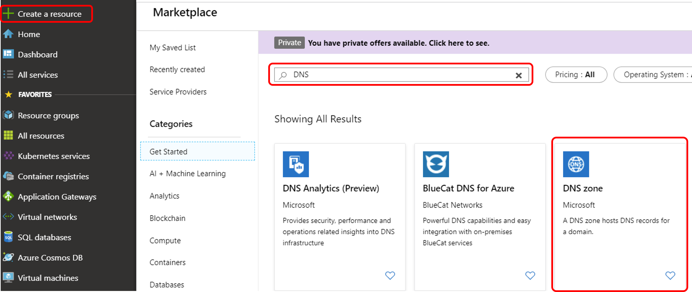

In the **Create DNS Zone** page, set the following information:

- **Resource Group**: name of the resource group where the DNS Zone resource will be provisioned
- **Name**: your domain name (like YOUR-COMPANY.com)
- **Location**: the location of if the provisioned resource (like West Europe)

In a few seconds the provision will be completed, navigate to the created DNS Zone to get the list of the Name Servers.

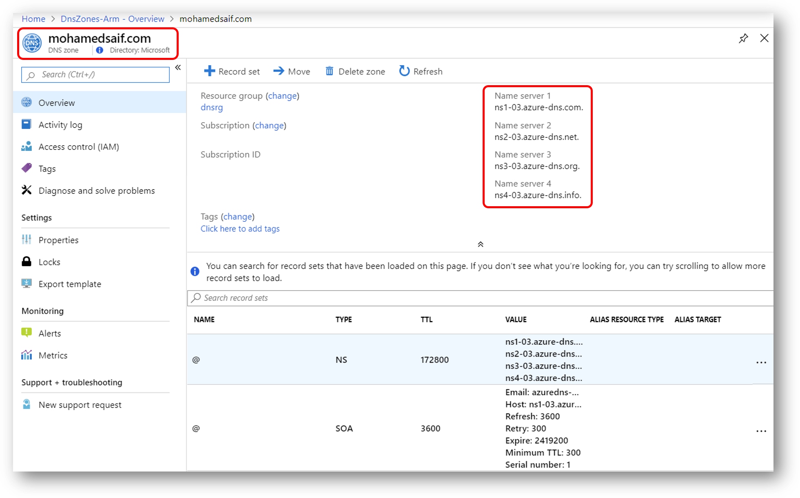

#### 1.1.B Azure DNS Using Azure CLI

```bash

### DNS Setup

# OPTION 1: Full delegation of a root domain to Azure DNS Zone
# Create a DNS Zone
az network dns zone create -g $RG -n $DNS_ZONE


# Delegate the DNS Zone by updating the Name Servers to Azure DNS Zone Name Servers
# Get the NS
az network dns zone show -g $RG -n $DNS_ZONE --query nameServers -o table

# Visit the registrar to update the NS records

# Check if the update successful, it might take several mins
nslookup -type=SOA $DNS_ZONE

# Reponse like
# Server: ns1-04.azure-dns.com
# Address: 208.76.47.4

# contoso.net
# primary name server = ns1-04.azure-dns.com
# responsible mail addr = msnhst.microsoft.com
# serial = 1
# refresh = 900 (15 mins)
# retry = 300 (5 mins)
# expire = 604800 (7 days)
# default TTL = 300 (5 mins)

# OPTION 2: Using subdomain
# Create a DNS Zone for subdomain
az network dns zone create -g $RG -n ocp-dev.$DNS_ZONE

### End DNS Setup

```

#### 1.2 Update Domain Registrar Name Servers

Now visit your domain registrar DNS Management page and update the Name Servers for that domain using the provided Azure Name Servers. 

This essentially will make Azure DNS delegated to managed the domain records.

>**NOTE:** My domain purchased and managed by GoDaddy domain services. So it was straight forward to update the Name Servers to Azure DNS.

### 2. Service Principal

Now we need a Service Principal to be used by the installer to provision the Azure infrastructure (like creating VMs)

I will use Azure Cloud Shell to do that.

You can also use your favorite terminal as well.

We will be using bash scripts.

Below is the scripts needs to be run.

#### 2.1 Login to Azure CLI

```bash

#***** Login to Azure Subscription *****
# A browser window will open to complete the authentication :)
# If you are using Azure Cloud Shell, you can skip this step as you already signed in
az login

# Make sure that the active Subscription is set (in case you have access to multiple subscription)
az account set --subscription "SUBSCRIPTION_NAME"

#Make sure the active subscription is set correctly
az account show

# Set the tenant ID
TENANT_ID=$(az account show --query tenantId -o tsv)
SUBSCRIPTION_ID=$(az account show --query id -o tsv)
echo $TENANT_ID
echo $SUBSCRIPTION_ID

clear

#***** END Login to Azure Subscription *****


```

#### 2.2 Service Principal Creation

```bash

### SP Setup

# Create a SP to be used by OpenShift
OCP_SP=$(az ad sp create-for-rbac -n "${PREFIX}-installer-sp" --skip-assignment)
# As the json result stored in OCP_SP, we use some jq Kung Fu to extract the values 
# jq documentation: (https://shapeshed.com/jq-json/#how-to-pretty-print-json)
echo $OCP_SP | jq
OCP_SP_ID=$(echo $OCP_SP | jq -r .appId)
OCP_SP_PASSWORD=$(echo $OCP_SP | jq -r .password)
OCP_SP_TENANT=$(echo $OCP_SP | jq -r .tenant)
OCP_SP_SUBSCRIPTION_ID=$SUBSCRIPTION_ID

# Save the following values to a protected location as you will need them during the use of the installer
echo $OCP_SP_ID
echo $OCP_SP_PASSWORD
echo $OCP_SP_TENANT
echo $OCP_SP_SUBSCRIPTION_ID

# Or create the SP and save the information to file
# az ad sp create-for-rbac --role Owner --name team-installer | jq --arg sub_id "$(az account show | jq -r '.id')" '{subscriptionId:$sub_id,clientId:.appId, clientSecret:.password,tenantId:.tenant}' > ~/.azure/osServicePrincipal.json

# Assigning AAD ReadWrite.OwnedBy
az ad app permission add --id $OCP_SP_ID --api 00000002-0000-0000-c000-000000000000 --api-permissions 824c81eb-e3f8-4ee6-8f6d-de7f50d565b7=Role

# Granting the AAD permission (Admin Consent required). 
# You can double check on Azure Portal to make sure the admin consent was granted
az ad app permission grant --id $OCP_SP_ID --api 00000002-0000-0000-c000-000000000000

# Assigning (Contributor or Owner) and "User Access Administrator"
az role assignment create --assignee $OCP_SP_ID --role "Owner"
# Or: az role assignment create --assignee $OCP_SP_ID --role "Contributor"
az role assignment create --assignee $OCP_SP_ID --role "User Access Administrator"

# Have a look at SP Azure assignments:
az role assignment list --assignee $OCP_SP_ID -o table

# If you wish to reset the credentials
# az ad sp credential reset --name $OCP_SP_ID

```

Checking on the AAD permission admin consent is granted successfully (if not, click on the Grant Admin Consent).

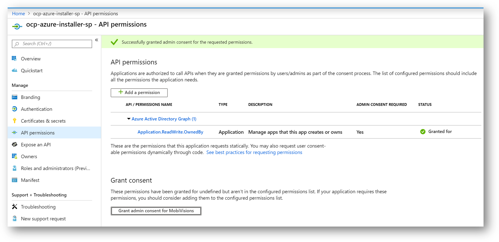

### 3. SSH Key

I would recommend providing SSH key during the setup, if you need to generate one, below is the command you need:

```bash

# Have an ssh key ready to be used
ssh-keygen -f ~/.ssh/openshift_rsa -t rsa -N ''

```

## OCP Installation

Now you are ready to use the IPI to provision 4.2 cluster on Azure :)

```bash

# Download the installer/client program from RedHat
# https://cloud.redhat.com/openshift/install/azure/installer-provisioned

# Get the json pull secret from RedHat
# https://cloud.redhat.com/openshift/install/azure/installer-provisioned

# Upload the files downloaded through Azure Cloud Shell or save tar.gz files to a folder if you are using client terminal (like OCP-Install)

# Extract the installer to installer folder
mkdir installer
tar -xvzf ./openshift-install-linux-4.2.0-0.nightly-2019-09-23-115152.tar.gz -C ./installer

mkdir client
tar -xvzf ./openshift-client-linux-4.2.0-0.nightly-2019-09-23-115152.tar.gz -C ./client

# Starting Installer-Provisioned-Infrastructure
# Change dir to installer
cd installer
./openshift-install create install-config

# Note: Credentials saved to /home/localadmin/.azure/osServicePrincipal.json

# Note: You can review the generated install-config.yaml and tune any parameters before creating the cluster

# Now the cluster configuration are saved to install-config.yaml

# Create the cluster based on the above configuration
./openshift-install create cluster

# By default, a cluster will create:
# Bootstrap:    1 Standard_D4s_v3 vm (removed after install)
# Master Nodes: 3 Standard_D8s_v3 (4 vcpus, 16 GiB memory)
# Worker Nodes: 3 Standard_D2s_v3 ().
# Kubernetes APIs will be located at something like:
# https://api.ocp-azure-dev-cluster.YOURDOMAIN.com:6443/

# Normal installer output
# INFO Consuming "Install Config" from target directory 
# INFO Creating infrastructure resources...         
# INFO Waiting up to 30m0s for the Kubernetes API at https://api.ocp-dev-ae.salesdynamic.com:6443... 
# INFO API v1.14.6+8d00594 up                       
# INFO Waiting up to 30m0s for bootstrapping to complete... 
# INFO Destroying the bootstrap resources...        
# INFO Waiting up to 30m0s for the cluster at https://api.ocp-dev-ae.salesdynamic.com:6443 to initialize... 
# INFO Waiting up to 10m0s for the openshift-console route to be created... 
# INFO Install complete!                            
# INFO To access the cluster as the system:admin user when using 'oc', run 'export KUBECONFIG=/home/localadmin/aks/AKS-SecureCluster/OCP/OCP-Install/installer/auth/kubeconfig' 
# INFO Access the OpenShift web-console here: https://console-openshift-console.apps.CLUSTER-NAME.DOMAIN-NAME.com 
# INFO Login to the console with user: kubeadmin, password: STju6-SEzcN-Nw8vT-nxdD8 

# Congratulations
# Although it says completed, you might need to give it a few mins to warm up :)

# You can access the web-console as per the instructions provided, but let's try using oc CLI instead
cd ..
cd client

# this step so you will not need to use oc login (you will have a different path)
export KUBECONFIG=/home/localadmin/aks/AKS-SecureCluster/OCP/OCP-Install/installer/auth/kubeconfig

# basic operations
./oc version
./oc config view
./oc status

# Famous get pods
./oc get pod --all-namespaces

# Our cluster running a kubernetes and OpenShift services by default
./oc get svc
# NAME         TYPE           CLUSTER-IP   EXTERNAL-IP                            PORT(S)   AGE
# docker-registry ClusterIP   172.30.78.158
# kubernetes   ClusterIP      172.30.0.1   <none>                                 443/TCP   36m
# openshift    ExternalName   <none>       kubernetes.default.svc.cluster.local   <none>    24m

# No selected project for sure
./oc project

# if you are interested to look behind the scene on what is happing, access the logs
cat ./.openshift_install.log

```

## Looking at the cluster

Now let's have a look inside Azure and OCP console.

### Resource Group

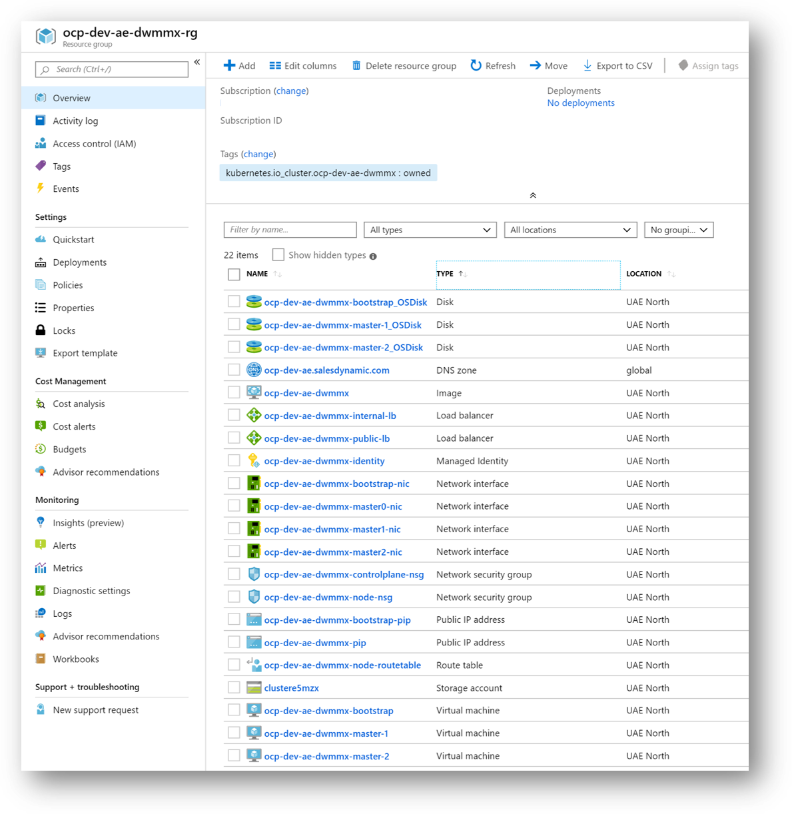

### Installer provisioned files

Have a look at the terraform files in addition to the installer logs

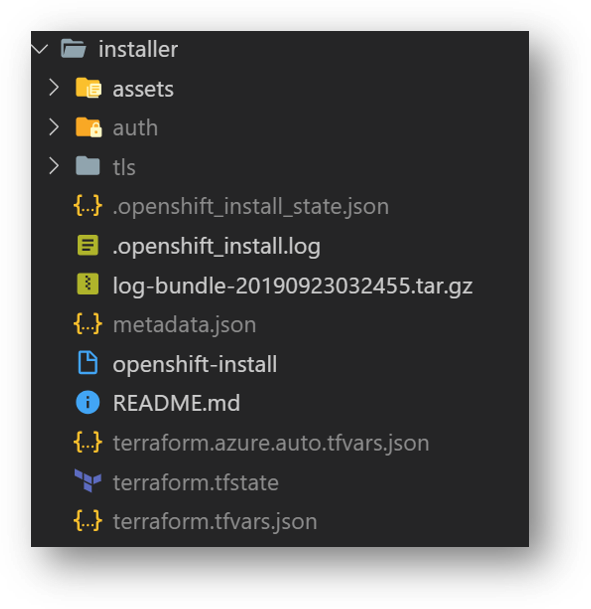

### Nested Subdomains

OCP Installer will use the provisioned DNS zone to configure all needed subdomains and nested subdomains to be used by the cluster.

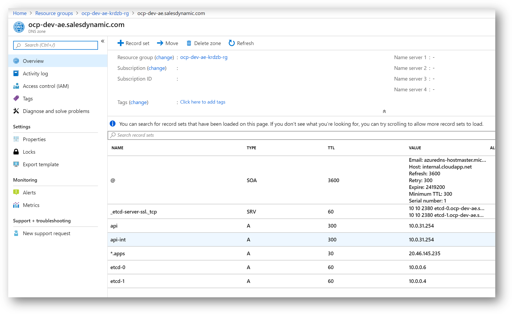

### Azure Storage Accounts for OS Images & Logs

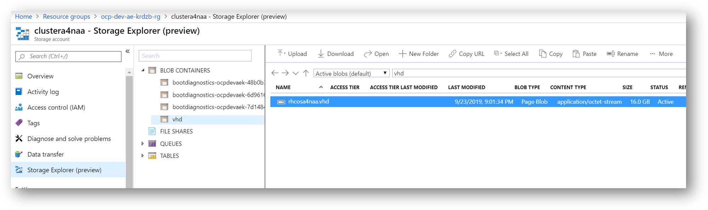

### OCP Projects

These are some of the projects that provisioned out of the box to have the OCP cluster operational

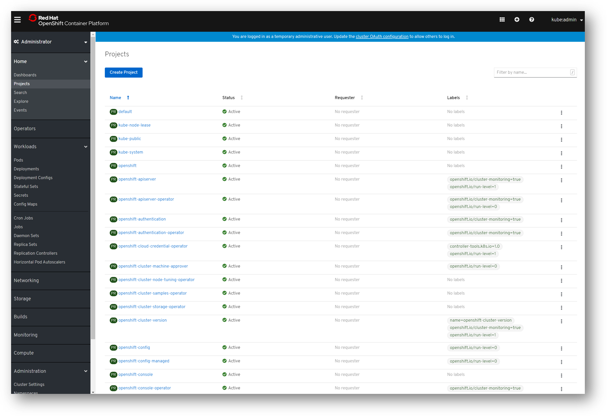

### OCP Cluster Settings - Cluster Operators 

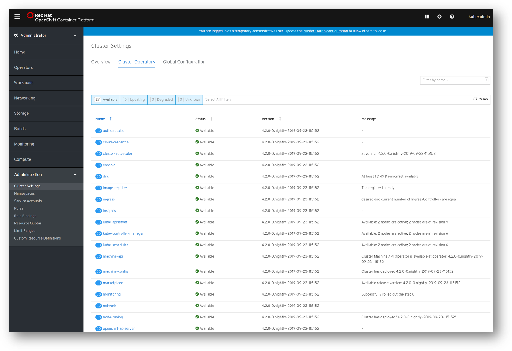

### Namespaces

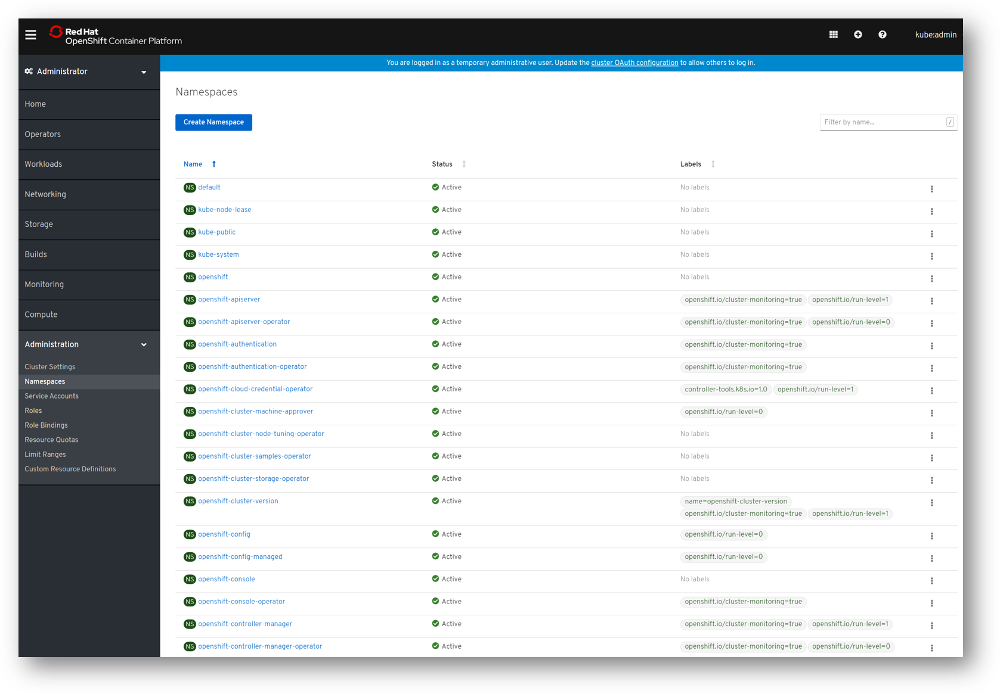

### Storage Classes

In order for most services to function, they need storage. 

OCP is provisioned out-of-the-box with Azure Premium Disk storage class (an attached disk to node)

Azure offers few other options that you can provision (like Azure Files which allow scenarios like ReadOnlyMany and ReadWriteMany).

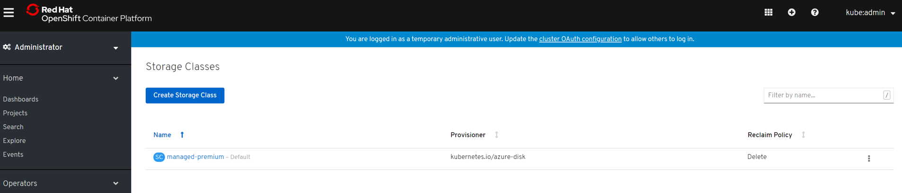

## Troubleshooting

### Destroy the cluster

If you need to delete the provisioned cluster, it is so simple thorugh the following command

```bash

# If cluster needs to be destroyed to be recreated, execute the following:
./openshift-install destroy cluster
# Note that some files are not removed (like the terrafrom.tfstate) by the installer. You need to remove them manually

```

### Troubleshooting 

#### Using the latest Release

I've wrote this repo during the final days of the Technical Preview of Azure IPI.

Almost everyday during the tech preview, a new installer version is released.

Make sure that you are using the latest version of the installer to get all the latest bits.

#### DNS is not ready

If you DNS is not ready or discoverable, the installer will not be able to reach the cluster APIs.

Issue was resolved by making sure the DNS ```nslookup``` return valid response as per the installation steps showed above.

#### Stuck at 99%

In my case, I missed to properly configure the AAD permissions for the (Service Principal) account. 

Issue was resolved through granting the correct permission and retry the installation.

#### Azure Subscription Limits

Some accounts (specially trial accounts) has limits on how many vCPU you can provision on the subscription. Below is some guidance on how you can deal with that.

```bash

# You might hit some subscription service provisioning limits:
# compute.VirtualMachinesClient#CreateOrUpdate: Failure sending request: StatusCode=0 -- Original Error: autorest/azure: Service returned an error. 
# Status=<nil> Code="OperationNotAllowed" Message="Operation results in exceeding quota limits of Core. Maximum allowed: 20, Current in use: 20
# , Additional requested: 8.
# Solving it is super easy, submit a new support request here:
# https://aka.ms/ProdportalCRP/?#create/Microsoft.Support/Parameters/
# Use the following details:
# Type	Service and subscription limits (quotas)
# Subscription	Select target subscription
# Problem type	Compute-VM (cores-vCPUs) subscription limit increases
# Click add new quota details (increase from 20 to 50 as the new quota)
# Usually it is auto approved :)
# To view the current limits for a specific location:
az vm list-usage -l $LOCATION -o table

```

#### OpenShift Installer Official GitHub

It is always good to check the official installer page on GitHub where you can find the latest information.

[OpenShift Azure Installer](https://github.com/openshift/installer/tree/master/docs/user/azure)